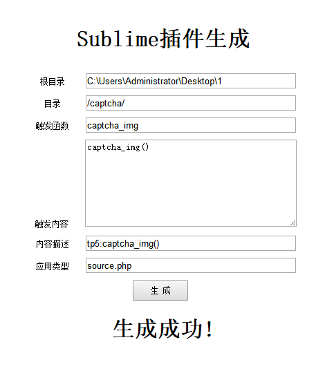

# Sublime 语法提示插件生成器

用于生成 Sublime Text 语法提示插件的工具，支持 PHP 和 Python。

## 功能特性

- 生成 Sublime Text 代码片段（Snippets）
- 支持 PHP 语法提示
- 支持 Python 语法提示
- 一键生成插件文件

## 项目结构

```
build-sublime-plug/
├── php/               # PHP 插件生成
│   ├── plug.php      # 插件生成类
│   ├── index.php     # 示例入口
│   └── run.bat      # 运行脚本
├── python3/          # Python 插件生成
│   ├── Plug.py      # 插件生成类
│   └── test.py      # 测试示例
├── demo.png         # 演示截图
└── README.md
```

## PHP 使用方法

### 1. 创建插件实例

```php
$plug = new Plug('输出目录', '子目录');
```

### 2. 生成代码片段

```php
$plug->build('触发词', '代码内容', '描述', '作用域');
```

### 参数说明

| 参数 | 说明 | 默认值 |
|------|------|--------|
| 触发词 | Tab 触发关键字 | 必填 |
| 代码内容 | 插入的代码 | 必填 |
| 描述 | 提示描述 | 必填 |
| 作用域 | 语法作用域 | `source.php` |

### 完整示例

```php
<?php
include 'plug.php';

$plug = new Plug('C:\\Users\\Administrator\\Desktop\\1', '\\');

$plug->build('where', 'where()', 'where查询');
$plug->build('foreach', 'foreach()', 'foreach循环');
```

## Python 使用方法

### 1. 创建插件实例

```python
plug = Plug('输出目录', '子目录')
```

### 2. 生成代码片段

```python
plug.build('触发词', '代码内容', '描述', '作用域')
```

### 完整示例

```python
from Plug import Plug

plug = Plug('./output', '/')

plug.build('print', 'print()', '打印输出', 'source.python')
```

## 生成的 Snippet 格式

```xml
<snippet>
    <content><![CDATA[代码内容]]></content>
    <scope>source.php</scope>
    <tabTrigger>触发词</tabTrigger>
    <description>描述</description>
</snippet>
```

## 相关插件案例

| 框架 | 仓库 |
|------|------|
| YAF | https://github.com/bool1993/sublime_yaf |
| Swoole | https://github.com/bool1993/sublime_swoole |
| ThinkPHP5 | https://github.com/bool1993/sublime_thinkphp5 |

## 依赖

- PHP 5.6+ 或 Python 3.6+

## 演示截图

| 演示 |
|------|
|  |
